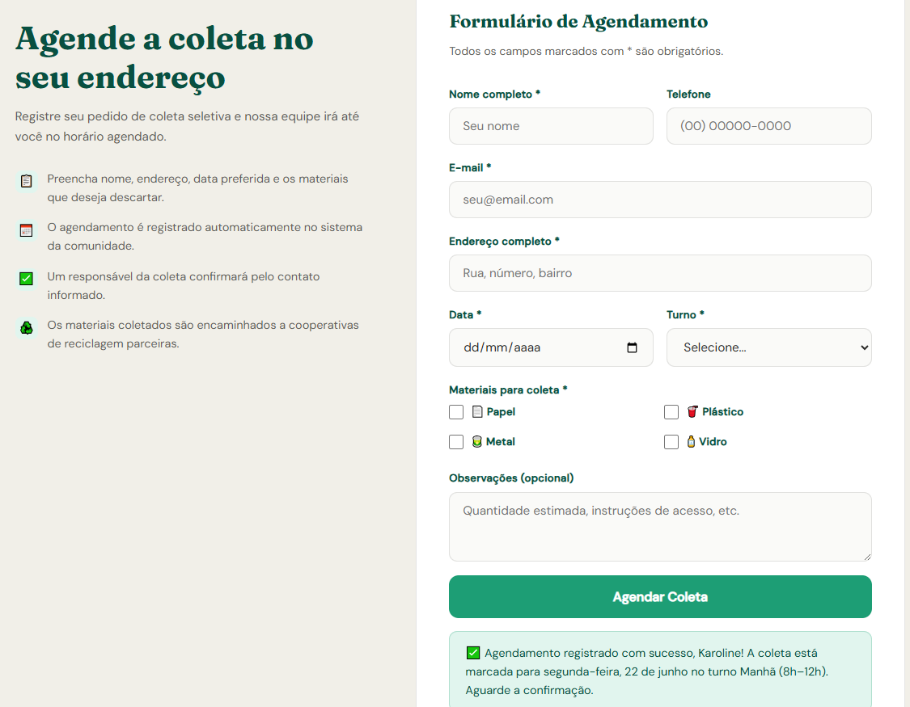

# ♻️ ReciclaFácil — Sistema Web para Agendamento de Coleta Seletiva

## 📌 Sobre o projeto
O ReciclaFácil é um sistema web desenvolvido como projeto extensionista, com o objetivo de promover a conscientização ambiental e facilitar o agendamento de coleta seletiva na comunidade local.

O sistema permite que o usuário:
- Aprenda sobre separação de resíduos (papel, plástico, metal e vidro)
- Acesse dicas de reciclagem
- Realize agendamento de coleta seletiva
- Receba confirmação por e-mail
- Utilize um chatbot de suporte

---

## 🌍 ODS relacionados
- ODS 9 – Indústria, inovação e infraestrutura  
- ODS 11 – Cidades e comunidades sustentáveis  
- ODS 12 – Consumo e produção responsáveis  
- ODS 13 – Ação contra a mudança climática  

---

## 🛠️ Tecnologias utilizadas
- HTML5  
- CSS3  
- JavaScript  
- Google Sheets (armazenamento de dados)  
- Google Apps Script (automação de e-mails)  

---

## 🚀 Funcionalidades
- Página informativa sobre reciclagem  
- Guia de separação de resíduos  
- Formulário de agendamento de coleta  
- Integração com Google Sheets  
- Envio automático de e-mail de confirmação  
- Chatbot interativo  

---

## 🌱 Impacto do projeto
O projeto contribui para a conscientização ambiental da comunidade local, incentivando a correta separação de resíduos e promovendo práticas sustentáveis alinhadas aos Objetivos de Desenvolvimento Sustentável (ODS).

Além disso, o sistema facilita o acesso à coleta seletiva, reduzindo descartes incorretos e apoiando cooperativas de reciclagem.

---

## 🧭 Como utilizar
1. Acesse o site publicado  
2. Leia as informações sobre reciclagem  
3. Preencha o formulário de agendamento  
4. Aguarde a confirmação por e-mail  

---

## 📸 Demonstração

### Formulário de Agendamento

---

## 🌐 Acesso ao projeto

🔗 Site publicado: https://karolinesousaa.github.io/ReciclaFacil/  
🔗 Repositório no GitHub: https://github.com/karolinesousaa/ReciclaFacil  

---

## 📚 Objetivo acadêmico
Projeto desenvolvido para atividade extensionista, com foco em educação ambiental e aplicação de tecnologia para solução de problemas reais da comunidade.

---

## 👩‍💻 Autora
Projeto desenvolvido por Karoline De Sousa Santos  
Curso: Análise e Desenvolvimento de Sistemas  
Instituição: Centro Universitário Internacional (Uninter)
